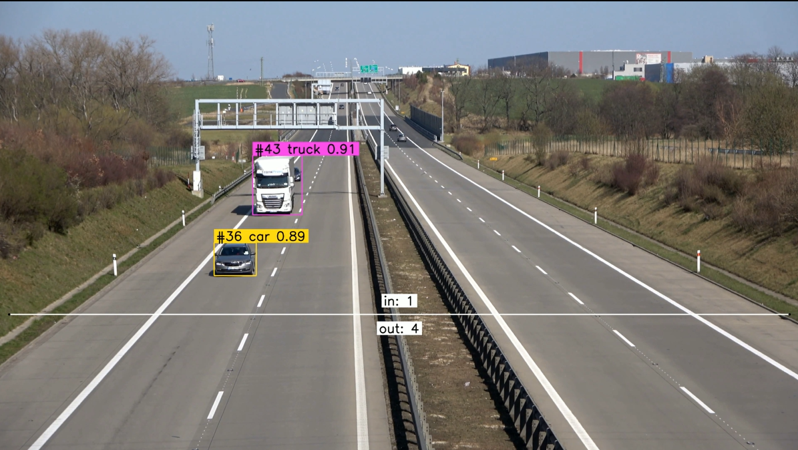

# Vehicle Counting and Tracking using YOLOv8 and ByteTrack


## 1. Introduction

This project aims to create a vehicle tracking and counting system using the YOLOv8 and ByteTrack models. It offers a reliable and efficient system for analyzing traffic flow, monitoring congestion, and enhancing overall road safety. The main components of the project are:
- **YOLOv8**: The YOLOv8 model from Ultralytics is utilized for accurate and real-time vehicle detection.  
- **ByteTrack**: ByteTrack algorithm is employed for multi-object tracking, ensuring smooth and reliable tracking of vehicles across frames.
- **Line Counter**: We use the supervision library to count the number of vehicles entering or leaving a region.
- **TensorRT Inference**: Export the model to TensorRT format to speed up inference.

## 2. Installation

To use this repository, we need to set up our environment with its required libraries. The steps are:

1. Clone the repository:

   ```
   git clone https://github.com/arief25ramadhan/vehicle-tracking-counting.git
   ```

2. Go to the repository, and install dependencies:

   ```
   cd vehicle-tracking-counting
   pip install -r requirements.txt
   ```

3. Inside this current repo, clone the ByteTrack Libraries:

    ```
   git clone https://github.com/ifzhang/ByteTrack.git
   ```
    
4. Install ByteTrack dependencies:
   ```
   cd ByteTrack
   
   # workaround related to https://github.com/roboflow/notebooks/issues/80
   sed -i 's/onnx==1.8.1/onnx==1.9.0/g' requirements.txt

   pip install -r requirements.txt

   python3 setup.py develop
   pip install cython_bbox onemetric loguru lap thop
   ```


## 3. Usage

To perform inference using the vehicle tracker and counter pipeline:
1. Go to `main.py`. In the last few lines, change the `input_video`, `output_video` and `use_tensorrt` variables accordingly. The `input_video` refers to the video we want to perform tracking and counting on, while the `output_video` is the desired path of the prediction. The `use_tensorrt` is a boolean variable indicating whether to use TensorRT format for a quicker inference time.
2. Save changes.
3. Run detection and tracking by executing this command in your terminal:

   ```
   python main.py
   ```

4. The predicted video should be available in the output_video path. Figure below displays the example frame of the predicted video.

<p align="center">
  
</p>


## References

This project is heavily based on tutorial by [Roboflow](https://github.com/roboflow) in this [colab notebook](https://colab.research.google.com/github/roboflow-ai/notebooks/blob/main/notebooks/how-to-track-and-count-vehicles-with-yolov8.ipynb#scrollTo=Q9ppb7bFvWfc). It works by combining the YOLOv8 model from Ultralytics and ByteTrack model developed by Yifu Zhange, et al. The links to the YOLOv8 and and ByteTrack repository are:

- YOLOv8: [Link to YOLOv8 repository](https://github.com/ultralytics/ultralytics)
- ByteTrack: [Link to ByteTrack repository](https://github.com/ifzhang/ByteTrack)
